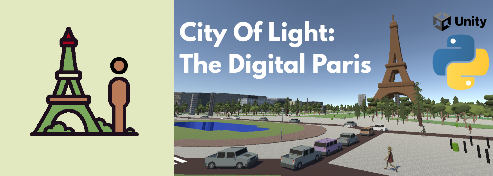

# City of Light (COL)

**A high-performance, Unity-based digital twin of Paris for embodied AI, robotics, and XR research.**

[](https://www.youtube.com/watch?v=KhIO3J9oGr8)

<p align="center">

<!-- []() -->
<!-- [](https://github.com/Paris-COL/CityOfLight/releases) -->
[](https://colab.research.google.com/drive/1Qw0uaRGRiITS5r77zU9NpuRp80KHVduO?usp=sharing)
[](https://www.youtube.com/watch?v=KhIO3J9oGr8)
[](LICENSE.md)
[](LICENSE_ASSETS.txt)
<!-- []() -->

</p>
<!-- [](https://arxiv.org/abs/XXXX.XXXXX) -->

<div align="center">
<strong>
[ <a href="#-quick-start">Quick Start</a> ·
<a href="#-features">Features</a> ·
<a href="#-licensing">Licensing</a> ·
<a href="#-citation">Citation</a> ]
</strong>
</div>

---

<p align="center">
  
</p>

**City of Light (COL)** is a geo-anchored, city-scale simulator of Paris (~116 km²) with synchronized multi-sensor streams (**RGB, Depth, Normals, Semantics**) and a zero-copy Python bridge (**TURBO**) that sustains very high throughput (up to ~1300 FPS on a 4090 in our tests).  
COL is designed for **fast scripting, large-scale data collection, RL, sim-to-real and embodied research**.

**This repository contains both the COL build releases and PyCol, a lightweight Python stack that lets you control and interact with COL easily.**

---

## 🧩 Features

- **Geo-faithful Paris digital twin** — per-tile meshes from public GIS.
- **Synchronized multi-sensors** — RGB / Depth / Normals / Semantics per frame.
- **TURBO zero-copy bridge** — shared-memory streaming to NumPy (no gRPC, no per-pixel copies).
- **High throughput** — frame-accurate control & observation at hundreds to thousands of FPS (resolution-scalable).
- **Dynamic runtime** — stochastic pedestrians & vehicles; chunk streaming with a 3×3 tile window.
- **Python-first workflow** — simple APIs to launch Unity, move/rotate the agent, step actions, and read frames.
- **Reproducible I/O** — deterministic stepping and per-frame update index.

---

## 🛠 Quick Start


1) Clone the repo (python package):
    ```
    git clone https://github.com/Paris-COL/CityOfLight.git
    ```

2) Download current Unity build:
    ```
    cd CityOfLight
    curl -fL "https://github.com/Paris-COL/CityOfLight/releases/download/0.1.0/COL_0.1.0_Linux_x86_64_demo.zip" -o COL_0.1.0_Linux_x86_64_demo.zip
    unzip -o COL_0.1.0_Linux_x86_64_demo.zip
    chmod +x ./unix/COL.x86_64
    ```

3) Launch the demo notebook and start exploring COL


## 📦 Documentation

*Coming soon.*


## 📜 Licensing

- **Code**: released under the **Apache 2.0** license. See `LICENSE.md`.
- **Assets (3D meshes, textures, etc.)**: released under **CC BY-NC 4.0**. See `LICENSE_ASSETS.txt`.


## ✏️ Citation

If you use **City of Light (COL)** in your research, please cite:

> (Citation to be added soon.)
A ready-to-use BibTeX entry will be provided here as soon as the paper is public.

---

## 🤝 Contributing

Contributions are welcome!

- Report bugs or request features via [GitHub Issues](https://github.com/Paris-COL/CityOfLight/issues).
- Open pull requests for:
  - Bug fixes
  - Performance improvements
  - New examples or tutorials
  - Extended sensors or environments


---

## 📨 Contact

For questions about COL, collaborations, or licensing, please open an issue or contact the maintainers via the repository’s contact email.

